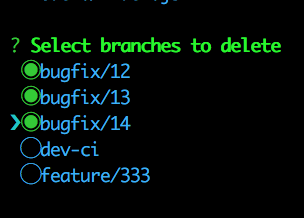

# GBRDM

**G**it **Br**anch **D**elete **M**ultiple.

Provides a CLI interface for deleting multiple local branches at the same time.

## Installation

```
npm install -g gbrdm
```

## Usage

Navigate to a directory that contains a `.git` directory.
```
gdbm
```
Select the branch(es) you'd like to remove




Confirm you really want to remove them


And your done!

## Reserved Branches
You will notice that running `gbdm` produces a list of _most_ of your local branches, but some may be missing.  There are several branch names that we won't inculde in group deleting.  These names are:
```
master
develop
test
staging
```

The reason for this is that the names above are commonly used for important branches.  You may still delete these branches if you choose, but you will need to do it outside of the `gbdm` interface.

## License
[MIT](LICENSE)
